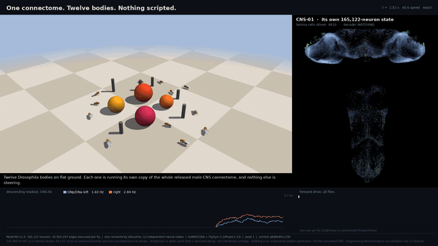
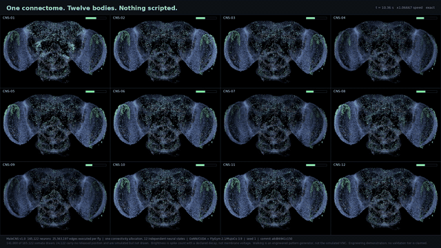
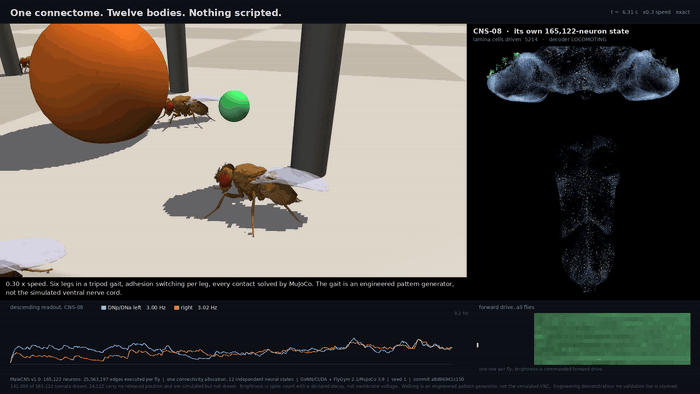
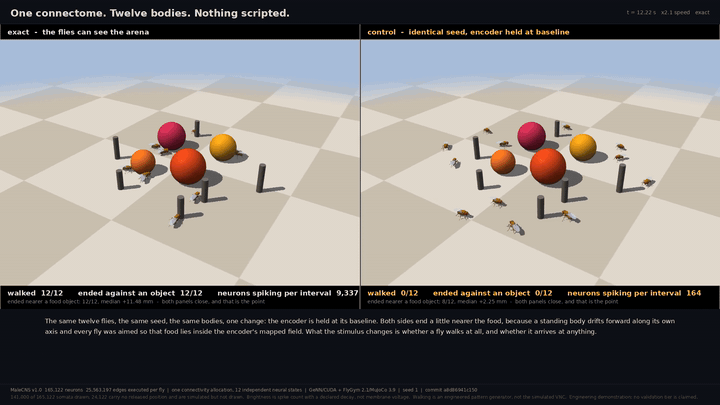

# MaleCNS Virtual Fly

A *Drosophila* brain simulator that runs the **complete released male CNS connectome** —
165,122 neurons, 25,563,197 synaptic edges — inside a physical fly body, in closed loop, on
one GPU.

It is not a recovered copy of the imaged fly, a complete biological emulation, or a digital
twin. What it is, and the evidence behind every number on this page, is set out in
[What is and is not claimed](#what-is-and-is-not-claimed).



## Twelve flies, twelve connectomes, one scene

Twelve full NeuroMechFly bodies in one MuJoCo scene, scattered at random over a 30 mm disc
and aimed at random. Each fly executes its own copy of the entire connectome every 15 ms
coupling interval, over **one** shared connectivity allocation with independent membrane,
adaptation, spike-counter and noise state. Food spheres and pillars are geoms with real
contact pairs; the bodies share one solver step, so they collide with each other and with the
objects through the physics rather than through a rule, and each fly is a visible object in
the others' visual fields.

Nothing steers them but two descending population rates read out of their own network.

| | GIF |
|---|---|
| **Twelve independent neural states over one connectivity allocation.** Brightness is spike count with a declared decay. |  |
| **0.30x speed.** Six legs in a tripod gait, adhesion switching per leg, every contact solved by MuJoCo. |  |
| **Exact against its control** — same seed, same bodies, encoder held at baseline. |  |

[**Watch the full 1:38 video**](artifacts/showcase/swarm3d-v1/swarm3d-showcase-web.mp4)
(1920x1080, 19 MB). What it measured, against the identical-seed stimulus-absent control:

| | exact | stimulus-absent |
| --- | --- | --- |
| flies that entered the locomoting state | 12 / 12 | 0 / 12 |
| flies that ended within 1 mm of an object's surface | 12 / 12 | 0 / 12 |
| neurons spiking per fly per coupling interval | 9,337 | 164 |
| straight-line displacement | 5.0 to 25.6 mm | 3.0 to 7.3 mm |
| ended nearer a food object | 12 / 12, median +11.48 mm | 8 / 12, median +2.25 mm |

Eleven of twelve reached a food sphere and stopped at its surface; the twelfth ended against
a pillar. **The last row is the one to be careful about**, and the video says so on screen: a
standing body drifts forward along its own axis, and headings are bounded so that food lies
inside the encoder's mapped visual field, so the control leans the same way. Closing distance
to food is *not* the discriminator. Ending against an object is — 12 of 12 against 0 of 12.

Two properties are checked rather than asserted, because the swarm reuses the frozen DEMO-01
network and reimplements its per-fly actuation. One fly driven through `SwarmWorld` and
through `Demo01VisualBody` under an identical command sequence agree to **0.0** on every one
of 133 `qpos` components; the multi-object encoder reproduces the frozen single-cue encoder to
**1.1e-13 Hz** on rates spanning 1 to 400 Hz. Both are in `tests/test_swarm3d.py`.

Operator handoff: [docs/showcase/SWARM3D.md](docs/showcase/SWARM3D.md). Decision record:
[ADR-2026-023](docs/adr/ADR-2026-023-embodied-3d-swarm-showcase.md), which also records the
two arenas that were built, measured and discarded first — each one exposed a property of the
frozen visual route that no previous experiment had tested.

## How it works

```
MaleCNS v1.0 (CC-BY)          165,122 neurons, 25,563,197 edges, checksum-locked
        |
   transmitter sign           per-neuron; unresolved signs are zeroed, not guessed
        |
   sparse graph build         hashed arrays, verified on every load
        |
   GeNN / CUDA                one connectivity allocation, N independent neuron states
        |    ^
 retinotopic |    | two descending population rates
 lamina      |    |
 encoder     |    v
        MuJoCo + NeuroMechFly 133 DOF, 42 actuated, contacts and adhesion solved
```

The full frame chain, including the causal queues that keep the body one interval behind the
neural engine, is in [docs/architecture.md](docs/architecture.md).

The loop is deliberately narrow and every narrowing is declared. Light enters one synapse
downstream of the photoreceptors, because all 66,533 photoreceptor output edges are zeroed by
the frozen unresolved-sign policy. The gait is a published pattern generator, not the
simulated ventral nerve cord. The readout is two numbers. Everything else the body and the
connectome could do is inert in this demonstration, and the inventory of what is inert is
part of the artifact rather than a footnote.

## What is and is not claimed

**The project sits at tier V0 Structural on its own V0–V8 ladder.** The swarm demonstration
awards no tier at all: both the run summary and the render manifest carry
`validation_tier_awarded: null` and `evidence_grade: false`, because no preregistered
biological hypothesis and no acceptance contract exists for a swarm. It demonstrates
machinery and validates no biology.

Specifically **not** claimed, and printed on the video frames rather than hidden here:

* **No social behaviour.** Flies aggregate because a nearby fly is a large object in the
  visual field and the network approaches large objects.
* **No foraging.** Food is a coloured sphere with a radius. The encoder has no colour channel
  and cannot tell food from a pillar; what separates them is angular size. There is no
  ingestion, no proboscis extension, no taste channel in this run.
* **The walking is engineered.** No part of the simulated ventral nerve cord contributes to
  leg movement.
* **The flies are not individuals.** Twelve parameterised copies of one specimen, differing
  in where they start, what they see from there, and their independent noise stream.
* **Rendering is software rasterisation** on the machine that produced these files, and the
  manifest records it.

The discipline that produces those statements is the point of the project as much as the
simulation is: every parameter carries a provenance class (`M` measured, `P` population prior,
`F` fitted, `E` engineering scaffold, `I` irrecoverable) and an assumption ID in
[`configs/assumptions.json`](configs/assumptions.json); evidence-grade runs refuse to start
from a dirty worktree; and criteria are registered before they are scored. Results that
failed are kept — see [docs/STATUS.md](docs/STATUS.md) for the current state, including
Track A's 0-of-30 grooming-displacement failure and a withdrawn evidence round.

## Quick start

The lightweight reference engine runs before FlyGym, CUDA or the MaleCNS data are installed:

```bash
uv python install 3.12
uv sync --python 3.12 --extra data --extra render
uv run flysim run eon-demo --seed 1 --headless
uv run flysim render runs/<run-id>
uv run pytest        # tests needing FlyGym, MuJoCo or CUDA skip
```

That produces the semantic engineering storyboard, which is also the project's neural-bypass
control. It is an `E` engineering scaffold and its manifest says so.

For anything that executes the real connectome you need the dataset and an NVIDIA GPU:

```bash
export FLYSIM_DATA_ROOT=/path/with/room          # dataset + run outputs
flysim data sync --profile starter               # public, no credentials
flysim data validate
flysim data import-aggregate
```

GeNN is a native CUDA source build rather than a registry package
(`scripts/install_genn.sh`), and the pinned production environment is Linux. On Windows it is
reached through WSL2. Full operator documentation, including the dataset profiles, the
preregistered matrices and the evidence-bundle path, is in
[docs/OPERATIONS.md](docs/OPERATIONS.md).

### Reproduce the swarm video

Recording and rendering are separate by construction: the run records whole-scene `qpos`
once per coupling interval and no frames at all, and the replay path refuses a world that has
ever been stepped, so rendering cannot advance a simulation.

```bash
PYTHONPATH=src python scripts/run_swarm3d_showcase.py \
    --duration-s 30 --variant exact --variant stimulus-absent --progress
PYTHONPATH=src python scripts/render_swarm3d_showcase.py \
    --run RUN_DIR/exact --control RUN_DIR/stimulus-absent \
    --out artifacts/showcase/swarm3d-v1/swarm3d-showcase.mp4 --progress
```

Cost, measured: twelve flies at 0.015x biological real time, about 33 minutes of wall clock
per variant on one RTX 3060 at 4.2 GB of device memory. That is not the GPU being slow — 30 s
of biology at the registered 100 µs neural step is 300,000 timesteps over 165,122 x 12 neuron
states, or 594 billion state updates, which would need roughly 1.2 TB/s of memory bandwidth
for the neuron state alone against the card's 360 GB/s.

## Other demonstrations

| | |
|---|---|
| **Interactive multi-fly arena** — a browser arena where you place cues and obstacles. The browser changes the world only; it cannot set neural activity, actuator commands or poses. `flysim web serve --mode preview` runs dependency-light and is explicitly labelled **no CNS**; `--mode full-cns` runs the real graph, slowly. | [ADR-2026-021](docs/adr/ADR-2026-021-live-multifly-showcase.md) |
| **Full-CNS cohort cinematic** — eight independent MaleCNS states around one visual cue, sharing one connectivity allocation. Engineering visualisation of cohort target approach, not biological swarming; the body is a display proxy rather than a recorded gait, which is why the embodied swarm above replaced it. | [ADR-2026-022](docs/adr/ADR-2026-022-swarm-cinematic-boundary.md) |
| **Eon-class showcase** — the earlier engineering demonstration lane and its corrected v2 validator. The archived v1 preview is [in this repository](artifacts/showcase/eon-showcase-v1/cinematic-demo.mp4); review found a direct world-gradient term in its navigation and 8.477 mm of grooming slide against a 2.5 mm cap, so it is retained as a labelled preview and not as a result. | [handoff](docs/showcase/EON_SHOWCASE_V2.md) |

## Repository map

| path | what is there |
|---|---|
| `src/flysim/` | the package: graph build, engines (`genn`, `lif`, `reference`), bodies, encoders, decoders, showcases |
| `src/flysim/swarm3d*.py` | the current embodied swarm: world, vision, runner, replay, video |
| `configs/assumptions.json` | the assumption register — every declared boundary, with an ID |
| `configs/datasets/` | one card per external dataset: source, checksum, licence, redistribution status |
| `configs/experiments/` | preregistered acceptance contracts and validation protocols |
| `docs/adr/` | decision records, in order, including the ones that record failures |
| `docs/evidence/` | measured reports; `LITERATURE_PARAMETER_CORPUS.md` is the parameter audit trail |
| `docs/STATUS.md` | what is true right now, dated |
| `docs/OPERATIONS.md` | the long-running commands: data, benchmarks, matrices, evidence bundles |
| `docs/REFERENCES.md` | how each source was used, licences, and the sources that were rejected |
| `docs/architecture.md` | the frame chain and the boundaries between tracks |
| `AGENTS.md` | the project's source of truth for scientific interfaces and claim discipline |
| `tests/` | 782 tests in 70 files; the two bit-parity tests for the swarm are in `test_swarm3d.py` |

## Sources

Everything below was read, downloaded or reused to build this. **No dataset here is
redistributed by this repository:** each is fetched by `flysim data sync`, checksummed, and
recorded in an immutable dataset lock. Licences and redistribution terms, which registry each
number landed in, and the sources that were read and *rejected*, are in
[docs/REFERENCES.md](docs/REFERENCES.md).

### The connectome

**MaleCNS v1.0** - HHMI Janelia FlyEM, CC-BY, <https://male-cns.janelia.org/download/>.
165,122 neurons and 25,563,197 edges across seven checksum-locked flat-connectome tables.

* Sexual dimorphism in the complete *Drosophila* male central nervous system connectome -
  [10.1016/j.cell.2026.08.015](https://doi.org/10.1016/j.cell.2026.08.015)
* Male gustatory connectome -
  [10.1016/j.cell.2026.08.016](https://doi.org/10.1016/j.cell.2026.08.016)
* Structural and male-female comparison supplement -
  <https://github.com/flyconnectome/2025malecns>

What the graph does not say about itself - its reconstruction completion rates, which qualify
every structural and functional claim made anywhere in this repository - is section 5 of
[the literature corpus](docs/evidence/LITERATURE_PARAMETER_CORPUS.md).

### Software this is built on

| component | role here | licence and source |
|---|---|---|
| **NeuroMechFly v2 / FlyGym** 2.1.0 | the body: 133 DOF, contact, adhesion, the published `HybridTurningController` gait | Apache-2.0, [10.1038/s41592-024-02497-y](https://doi.org/10.1038/s41592-024-02497-y), <https://github.com/NeLy-EPFL/flygym> |
| **MuJoCo** 3.9 | rigid-body physics, contacts, rendering | Apache-2.0 |
| **GeNN / PyGeNN** | the sparse CUDA engine that executes the full graph | <https://github.com/genn-team/genn> |
| **Brian2** | small-circuit numerical oracle the engine is checked against | CeCILL-2.1, <https://github.com/brian-team/brian2> |
| **Shiu et al. 2024** whole-brain LIF model | Stage 1 regression reference; selected circuit tests reproduce its archived outputs | MIT, [10.1038/s41586-024-07763-9](https://doi.org/10.1038/s41586-024-07763-9), archive [10.17617/3.CZODIW](https://doi.org/10.17617/3.CZODIW) |
| **Eon fly-brain** | reproduction reference and attributed implementation ideas | GPL-2.0-or-later, <https://github.com/eonsystemspbc/fly-brain> |

### Papers behind the registered parameters

Fourteen full-text papers were read and every quantitative value extracted with its
measurement conditions. A paper appearing here does not mean its value was accepted: the corpus
records what was rejected, and one registered value that an independent measurement
contradicts.

| citation | what it supplies |
|---|---|
| Kazama & Wilson 2008, *Neuron* 58:401-413 - [10.1016/j.neuron.2008.02.030](https://doi.org/10.1016/j.neuron.2008.02.030) | uEPSC/uEPSP amplitudes per glomerulus, quantal parameters, release-site counts, 7 Hz depression |
| Kazama & Wilson 2009, *Nat Neurosci* - origins of correlated activity in an olfactory circuit | complete ORN-to-PN convergence, ORN counts per glomerulus |
| Nagel, Hong & Wilson 2015, *Nat Neurosci* 18:56-65 - [10.1038/nn.3895](https://doi.org/10.1038/nn.3895) | two-component EPSC kinetics and conductances, the registered depression fit, presynaptic inhibition |
| Gouwens & Wilson 2009, *J Neurosci* - [10.1523/JNEUROSCI.0764-09.2009](https://doi.org/10.1523/JNEUROSCI.0764-09.2009) | measured PN input resistance, seal-conductance correction to resting potential |
| Gaudry, Hong, Kain, de Bivort & Wilson 2012, *Nature* - [10.1038/nature11747](https://doi.org/10.1038/nature11747) | ipsi/contra release asymmetry and odour lateralisation |
| Gugel et al. 2023, *eLife* 12:e85443 - [10.7554/eLife.85443](https://doi.org/10.7554/eLife.85443) | the DL5 uEPSC recordings in the corpus |
| Rozenfeld, Ehmann, Manoim, Kittel & Parnas 2023, *Nat Commun* - [10.1038/s41467-023-38575-6](https://doi.org/10.1038/s41467-023-38575-6) | independent release-site estimate, homeostatic active-zone plasticity |
| Pooryasin et al. 2021, *Nat Commun* - Unc13A and Unc13B | two release-machinery populations with distinct short-term plasticity |
| Nanami et al. 2024, *Front Neurosci* 18:1384336 - [10.3389/fnins.2024.1384336](https://doi.org/10.3389/fnins.2024.1384336) | PN current-clamp recordings, and an unfitted-LIF comparison model |
| Davis et al. 2020, *eLife* 50901 - [10.7554/eLife.50901](https://doi.org/10.7554/eLife.50901) | cell-type-resolved transcriptomes, visual system only |
| Lappalainen et al. 2024, *Nature* 634:1132 - [10.1038/s41586-024-07939-3](https://doi.org/10.1038/s41586-024-07939-3) | connectome-constrained network prior art; the methodological benchmark |
| Mapping of neurotransmitter receptor subtypes to the connectome | receptor subunit localisation; the definitive answer on functional edge polarity |
| Interactions between specialized gain control mechanisms in olfactory processing | LN classes performing local versus global gain control |
| The MaleCNS paper itself | counts and reconstruction completion rates |
| Liu et al. 2022 - [PMC8825683](https://pmc.ncbi.nlm.nih.gov/articles/PMC8825683/) | the contact-to-release-site relationship; obtained only in part |
| Takagi et al. 2024, *Nat Commun* - [10.1038/s41467-024-50808-w](https://doi.org/10.1038/s41467-024-50808-w) | ORN population expansions and PN adaptation |

### Behaviour, mapping and cell-type sources

| source | supplies |
|---|---|
| Ozdil et al. 2026, centralized brain networks controlling antennal grooming - [10.1038/s41467-026-72152-x](https://doi.org/10.1038/s41467-026-72152-x), collection [10.7910/DVN/N8ITTG](https://doi.org/10.7910/DVN/N8ITTG) | the checksum-locked antennal-grooming joint trajectory Track A replays |
| Johnston's-organ receptor spiking - [10.1016/j.cub.2013.10.006](https://doi.org/10.1016/j.cub.2013.10.006) | class-level evidence behind the LIF fallback registered for JO-F and JO-FD types |
| [10.1038/srep21841](https://doi.org/10.1038/srep21841), [10.1038/s41467-019-09069-1](https://doi.org/10.1038/s41467-019-09069-1) | odorant-receptor-glomerulus mapping for the `eon-demo` storyboard, declared an engineering bypass |
| [10.1038/s41586-025-09554-2](https://doi.org/10.1038/s41586-025-09554-2) | the DNg97/oDN1 identity behind Track A's descending crosswalk |
| Seki et al. 2010 - [10.1152/jn.00249.2010](https://doi.org/10.1152/jn.00249.2010); Inada et al. 2017 - [10.1016/j.celrep.2017.05.049](https://doi.org/10.1016/j.celrep.2017.05.049) | antennal-lobe local neuron and Kenyon cell physiology |
| Gouwens & Wilson DM1 passive model - [ModelDB 118662](https://github.com/ModelDBRepository/118662) | published passive-model source; redistribution from this project is disabled |

### Method and boundary prior art

Used as method or as a limit marker, never as a source of numbers:
[Effectome](https://doi.org/10.1038/s41586-024-07982-0) (connectome weights as priors for
fitted causal effects), [FlyVis](https://doi.org/10.1038/s41586-024-07939-3) (visual type
sharing and fitting precedent), [BrainTrace](https://doi.org/10.1038/s41467-026-68453-w)
(scalable fitting, and evidence that background drive matters),
[inter-individual connectome variability](https://doi.org/10.1038/s41586-024-07686-5),
[BANC](https://doi.org/10.1038/s41586-026-10735-w) (female brain-and-cord comparison),
[the adult mushroom-body connectome](https://doi.org/10.7554/eLife.62576),
[adult muscle motor-unit physiology](https://pmc.ncbi.nlm.nih.gov/articles/PMC7347388/),
[femoral chordotonal biomechanics](https://pmc.ncbi.nlm.nih.gov/articles/PMC10644877/) and
[the DoOR odour-response database](https://pmc.ncbi.nlm.nih.gov/articles/PMC4766438/).

[Flybody](https://doi.org/10.1038/s41586-025-09029-4) and
[FlyMimic](https://openreview.net/forum?id=6lEjX1getx) were consulted as whole-body and
muscle-level baselines and are **not** used. That is why wing flapping produces exactly zero
lift in this body, and why the project says so instead of implying flight
([ADR-2026-017](docs/adr/ADR-2026-017-a-wing-command-in-a-body-with-no-air.md)).

### Datasets with their own cards

Each carries its source URL, checksum, licence and redistribution status in
[`configs/datasets/`](configs/datasets):

```
malecns-v1.0                     the connectome, CC-BY
berg-malecns-2025-supplement     structural and male-female comparison tables
morphology-canaries              skeleton SWCs that detect a silently changed release
shiu-2024-brain-model            Stage 1 regression reference and archived outputs
ozdil-2026-antennal-grooming     grooming supplementary data ...
   ... -trajectory               ... and the replayed joint trajectory
gugel-2023-elife-85443           uEPSC source data, Dryad 10.5061/dryad.v15dv420q
nanami-2024-pn-current-clamp     PN current-clamp recordings ...
   ... -invivo-cellular-pack     ... and the in vivo pack redistributed alongside them
gouwens-wilson-2009-dm1-modeldb  published DM1 passive model, redistribution disabled
stage2-2026-09-09-intake         classification of a staged dataset drop
stage2-reservations-v1           which files, variables and columns are RESERVED and unopened
```

The last card is load-bearing for the validation discipline: data declared reserved stays
unread until a preregistered test opens it, because reading it spends it.

## Contributing, licence, citation, security

Setup, the checks CI runs, and the handful of rules that are not style are in
[CONTRIBUTING.md](CONTRIBUTING.md).

Project code is GPL-2.0-or-later. Dataset and dependency licences remain their own — see
[THIRD_PARTY_NOTICES.md](THIRD_PARTY_NOTICES.md). Cite the software release **and** the exact
MaleCNS release a run used ([CITATION.cff](CITATION.cff)). Credential handling and the dataset
lock rules are in [SECURITY.md](SECURITY.md).
